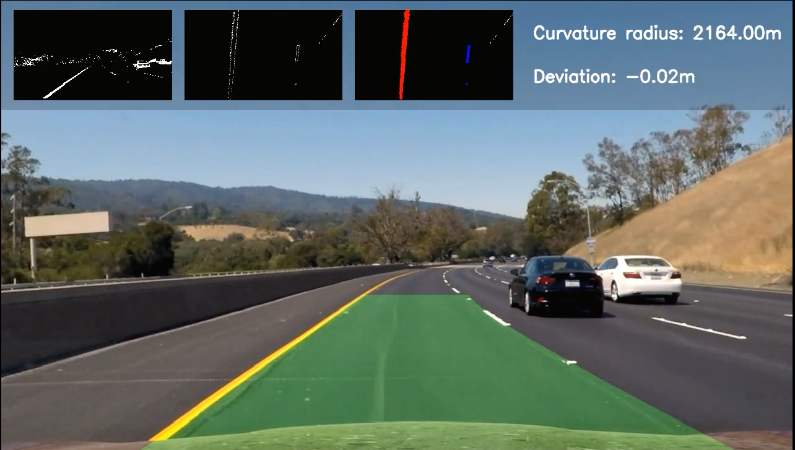

# Advanced Lane Finding Project 

Self-Driving Car Engineer Nanodegree Program

## Project Introduction

Lane line recognition is a basic function of automatic driving, which plays an important role in assisted driving functions such as lane line keeping and lane departure warning. This project will identify the lane line based on perspective transformation and curve fitting.

## Project Steps

The goals / steps of this project are the following: 
- Compute the camera calibration matrix and distortion coefficients given a set of chessboard images.
- Apply a distortion correction to raw images. 
- Use color transforms, gradients, etc., to create a thresholded binary image. 
- Apply a perspective transform to rectify binary image ("birds-eye view").
- Detect lane pixels and fit to find the lane boundary.
- Determine the curvature of the lane and vehicle position with respect to center. 
- Warp the detected lane boundaries back onto the original image. 
- Output visual display of the lane boundaries and numerical estimation of lane curvature and vehicle position. 

## Project Result

The final result is as follows：

The video has been sent to [Tencent](https://v.qq.com/x/page/m0923upwoq3.html?).

## Thing need to be done

The method of this project is to divide the video into pictures and then identify the lane line in the picture. There are two things that can be improved:

- Lane lines have a fixed width, which helps improve lane line detection accuracy in complex road conditions, such as lines on the road that are parallel to the lane line. This is not used.

- The lane lines are continuous and will not be abrupt, the curvature and position of the lane lines of two adjacent frames are similar, this feature can effectively suppress the detected lane line abrupt changes. This is not considered
